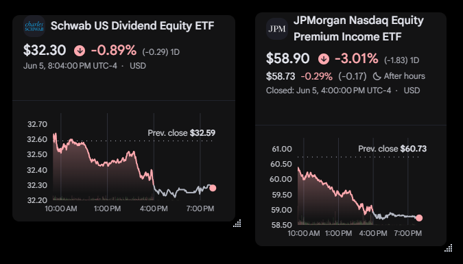

<p align="center">
  
</p>

<h1 align="center">Finance Widget (v0.9.3)</h1>

<p align="center">
  A lightweight, modern desktop application for Windows that displays clean, borderless stock and ETF charts powered by Google Finance.
</p>

## Download
You can download the latest version from the **[GitHub Releases](https://github.com/Genghis1227/FinanceWidget/releases)** page. The application is distributed as a ZIP archive; simply extract it and run `FinanceWidget.exe`.

## What's New
Check out the latest features and fixes in our **[Release Notes](ReleaseNotes/latest_release_notes.md)**. You can find the full history of changes in the **[ReleaseNotes](ReleaseNotes/)** directory.


## Features
- **Multi-Widget Support:** Spawn as many independent widgets as you want.
- **System Tray Integration:** Runs quietly in the background without cluttering your taskbar.
- **Tray Icon Double-Click:** Quickly bring all active widgets to the foreground by double-clicking the system tray icon.
- **State Persistence:** Automatically remembers your chosen ticker symbols, window positions, and "Keep on Top" preferences across restarts.
- **Clean UI:** Injects custom CSS and JavaScript to strip away headers, footers, breadcrumbs, and sidebars from Google Finance — leaving just the essential data.
- **Popular Ticker Lookup**: Browse and add top Stocks, Crypto, and ETFs from a curated lookup screen.
- **Elegant Ticker Entry**: Clean, modern prompt for adding widgets with one-tap clickable suggestions.
- **Advanced Beta UI Cleanup:** Refined logic to hide intrusive "Overview", "Financials", and AI Insights sections in the Google Finance Beta interface.
- **Dynamic Scroll Correction**: Smart layout stabilization that prevents X-axis labels from being cut off during After Hours.
- **Dynamic Backgrounds:** Widget backgrounds automatically sync with the site theme — using Google's signature Dark Mode (#131314) for Beta and clean White for Classic.
- **Google Login Support:** Right-click any widget and choose **"Login to Google"** to sign into your Google account directly in the widget. Login persists across restarts.
- **Check for Updates**: Easily check for newer versions and download them directly from GitHub via the context menu.
- **In-App Release Notes**: Quick access to version-specific release notes from any widget or the tray icon.
- **Resizable Widgets:** Freely resize any widget by dragging its edges or the bottom-right corner. The internal graph and layout automatically adjust to fit the new size.
- **Keep on Top:** Pin individual widgets to always stay above other windows.

## Requirements
To run the application, you only need:
- Windows 10 or 11
- [Microsoft Edge WebView2 Runtime](https://developer.microsoft.com/en-us/microsoft-edge/webview2/) (Pre-installed on Windows 11 and most Windows 10 systems)

### Windows SmartScreen Warning
Because this application is a community project and is not signed with a commercial developer certificate, Windows may display a **"Windows protected your PC"** warning when you first run it.

To run the app:
1. Click **"More info"**.
2. Click **"Run anyway"**.

---

## Building & Deploying
This project is built using WPF and .NET 10. To package the application into a single, self-contained executable, run the following command in the project directory:

```powershell
dotnet publish -c Release -r win-x64 --self-contained true -p:PublishSingleFile=true -p:IncludeNativeLibrariesForSelfExtract=true
```

The resulting executable will be placed in:
`bin\Release\net10.0-windows\win-x64\publish\FinanceWidget.exe`

## Preview
<p align="center">
  
</p>

## Usage
1. Launch `FinanceWidget.exe`.
2. Find the icon in your System Tray (bottom right of your screen, near the clock).
3. **Add Additional Widgets:** Right-click the tray icon and select **"Add New Widget"**. An elegant prompt will appear asking for the ticker symbol you want to track.
4. **Change the Ticker:** Right-click any widget and click **"Settings"**.
5. **Ticker Format:** Symbols use Google Finance format (`TICKER:EXCHANGE`). For example:
   - `.INX:INDEXSP` (S&P 500 Index)
   - `AAPL:NASDAQ` (Apple)
   - `JEPQ:NASDAQ` (JPMorgan Nasdaq Equity Premium Income ETF)
   - `ETH-USD` (Ethereum to USD)
6. **Move & Organize:** Drag any widget by its top gray drag-handle to reposition it on your screen. Resize from the edges or bottom-right corner to change the widget's dimensions.
7. **Keep on Top:** Right-click any widget and toggle **"Keep on Top"** to pin it above other windows.
8. **Login to Google:** Right-click and select **"Login to Google"** to authenticate. After sign-in, Google redirects back to Finance automatically. Use **"Return to Finance"** if you need to navigate back manually.
9. **Exit:** Right-click the system tray icon and select **"Exit All"** to close everything.
