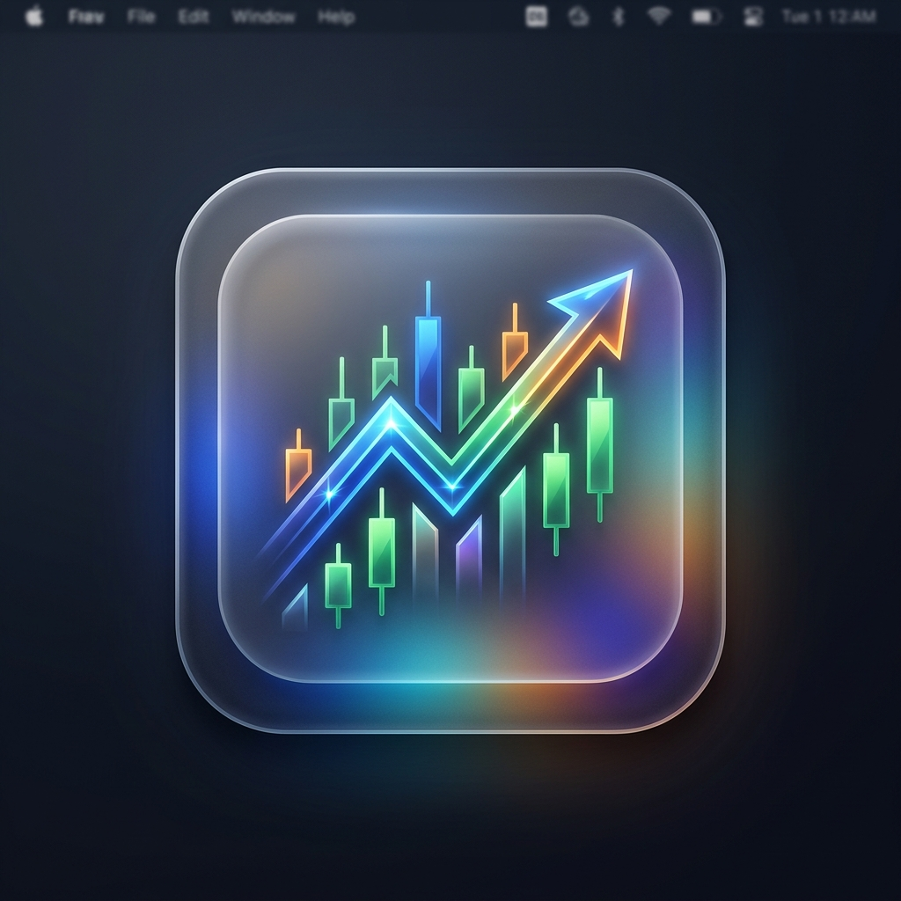

# Finance Widget (v0.4)



A lightweight, modern desktop application for Windows that displays clean, borderless stock and ETF charts powered by Google Finance.

## Features
- **Multi-Widget Support:** Spawn as many independent widgets as you want.
- **System Tray Integration:** Runs quietly in the background without cluttering your taskbar.
- **State Persistence:** Automatically remembers your chosen ticker symbols, window positions, and "Keep on Top" preferences across restarts.
- **Clean UI:** Injects custom CSS and JavaScript to strip away headers, footers, breadcrumbs, and sidebars from Google Finance — leaving just the essential data.
- **Smart Mode Detection:** Automatically detects whether the site is in Classic or Beta mode and applies version-specific cleanup logic.
- **Dynamic Backgrounds:** Widget backgrounds automatically sync with the site theme — using Google's signature Dark Mode (#131314) for Beta and clean White for Classic.
- **Google Login Support:** Right-click any widget and choose **"Login to Google"** to sign into your Google account directly in the widget. Login persists across restarts.
- **Beta UI Support:** Experimental support for the Google Finance Beta interface with advanced cleanup to hide intrusive banners and research drawers.
- **Keep on Top:** Pin individual widgets to always stay above other windows.

## Requirements
To run the pre-built single-file executable, you only need:
- Windows 10 or 11
- [Microsoft Edge WebView2 Runtime](https://developer.microsoft.com/en-us/microsoft-edge/webview2/) (Pre-installed on Windows 11 and most Windows 10 systems)

## Building & Deploying
This project is built using WPF and .NET 10. To package the application into a single, self-contained executable, run the following command in the project directory:

```powershell
dotnet publish -c Release -r win-x64 --self-contained true -p:PublishSingleFile=true -p:IncludeNativeLibrariesForSelfExtract=true
```

The resulting executable will be placed in:
`bin\Release\net10.0-windows\win-x64\publish\FinanceWidget.exe`

## Usage
1. Launch `FinanceWidget.exe`.
2. Find the icon in your System Tray (bottom right of your screen, near the clock).
3. **Add Additional Widgets:** Right-click the tray icon and select **"Add New Widget"** to spawn as many independent trackers as you want.
4. **Change the Ticker:** Right-click any widget and click **"Settings"**.
5. **Ticker Format:** Symbols use Google Finance format (`TICKER:EXCHANGE`). For example:
   - `AAPL:NASDAQ` (Apple)
   - `VOO:NYSEARCA` (Vanguard S&P 500 ETF)
   - `JEPQ:NASDAQ` (JPMorgan Nasdaq Equity Premium Income ETF)
   - `SCHD:NYSEARCA` (Schwab US Dividend Equity ETF)
6. **Move & Organize:** Drag any widget by its top gray drag-handle to reposition it on your screen.
7. **Keep on Top:** Right-click any widget and toggle **"Keep on Top"** to pin it above other windows.
8. **Login to Google:** Right-click and select **"Login to Google"** to authenticate. After sign-in, Google redirects back to Finance automatically. Use **"Return to Finance"** if you need to navigate back manually.
9. **Exit:** Right-click the system tray icon and select **"Exit All"** to close everything.
